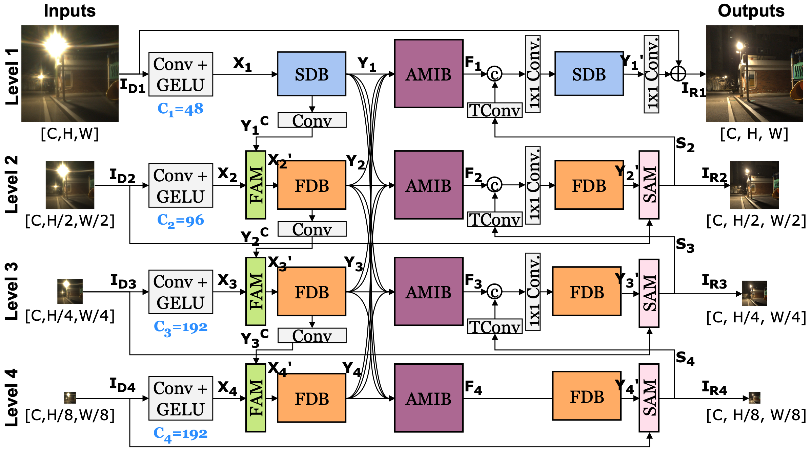

# SFIM

This repository contains the code for SFIM model of the following paper.
> Kyusu Ahn, Jinpyo Kim, Chanwoo Park, JiSoo Kim, and Jaejin Lee. **Integrating Spatial and Frequency Information for Under-Display Camera Image Restoration** arXiv preprint arXiv:2501.18517 (2025).<br>

[[Paper](https://arxiv.org/pdf/2501.18517)]

## SFIM Architecture

The following diagram illustrates the SFIM model architecture:




## Requirement
This project requires the following dependencies:
- **Python**: 3.9.16
- **PyTorch**: 2.0.1  
- **CUDA**: 11.8  
- **cuDNN**: 8.7.0 
- **OpenMPI**: 4.1.0+ (for multi-GPU distributed execution)
- **GPU**: NVIDIA GeForce RTX 3090  

To set up the environment, install dependencies using:  
```bash
conda env create -f udc.yaml
```

## Get Started
This repository provides scripts for training and testing the model.

### Dataset Setup

To properly set up the dataset, create a symbolic link inside the `SFIM` directory that points to the actual dataset location.  

Run the following command:  
```bash
ln -s /path/to/your/dataset SFIM/UDC-SIT
```

### Train
To start training, run the following command:  
```bash
mpirun -np 4 -H b03:4 -x MASTER_ADDR=b03 ./run_train.sh
```

### Test
To evaluate the trained model, run the following command:   
```bash
mpirun -np 4 -H b03:4 -x MASTER_ADDR=b03 ./run_test.sh
```
This script will load the trained model and perform inference on the test dataset.


## Results
The following image shows the results of the SFIM model on UDC-SIT. The results shows that SFIM outperforms the others in eliminating the flare caused by distortion around light sources.


## Citation

   If you find our repository useful for your research, please consider citing our paper:

   ```bibtex
    @article{ahn2025integrating,
      title={Integrating Spatial and Frequency Information for Under-Display Camera Image Restoration},
      author={Ahn, Kyusu and Kim, Jinpyo and Park, Chanwoo and Kim, JiSoo and Lee, Jaejin},
      journal={arXiv preprint arXiv:2501.18517},
      year={2025}
    }
   ```

## Licences

Copyright (c) 2025 Thunder Research Group, Seoul National University

SFIM code is licensed under the Creative Commons Attribution-NonCommercial-ShareAlike 4.0 International (CC BY-NC-SA 4.0). This means that you are allowed to freely utilize, share, and modify this work under the condition of properly attributing the original author, distributing any derived works under the same license, and utilizing it exclusively for non-commercial purposes.

## Acknowledgement
Thanks to the great efforts of the open-sourced projects.
- ECFNet (<https://github.com/zhuyr97/ECFNet>)
- Uformer (<https://github.com/ZhendongWang6/Uformer>)
- CBAM (<https://github.com/Jongchan/attention-module>)
- MIMO-UNet (<https://github.com/chosj95/MIMO-UNet>)
